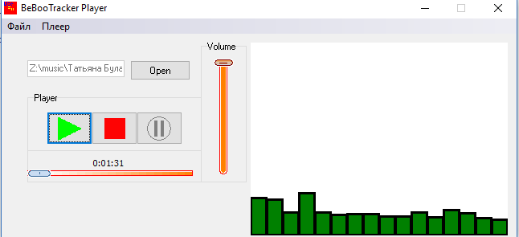
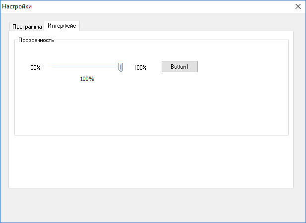

# BeeBooTracker player

A simple player using bass.dll library and its add-ons written on Delphi 

(c) Copyright P1ratRuleZZZ 2010

## Player

Supported formats: FLAC, ALAC, MOD, XM (tracker from keygens), MP3, AAC, OGG and many other audio formats.

## Disclaimer

This is just a college project, I hope it can help to some developers who is searching for sources and examples of how to work with bass.dll library. And this was uploaded here just in order to save this and share. Maybe somebody will be inspired and will develop a nice looking player and it will be the same as Winamp for 2000s.

## Download

[Download release v0.0.1](https://github.com/p1ratrulezzz/beebootrackermusicplayer/releases/download/0.0.1/BeeBooTrackerPlayer-v0.0.1.zip)
